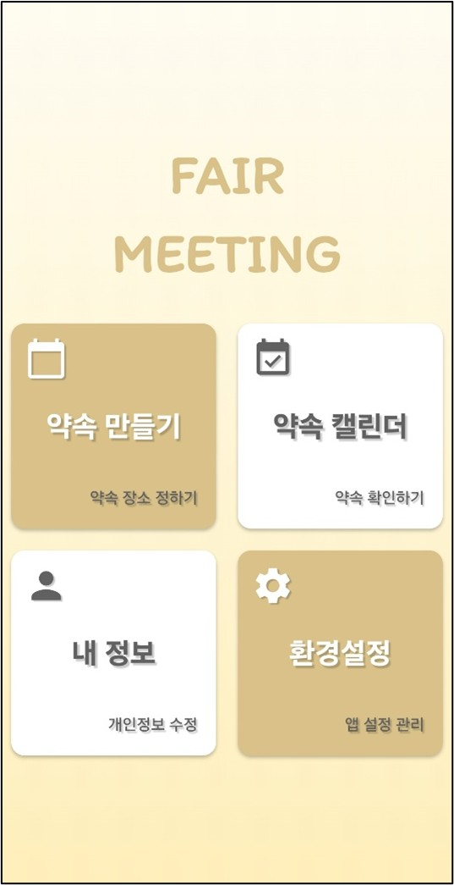
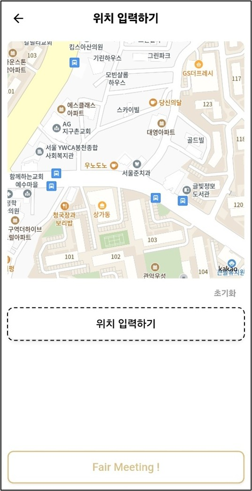
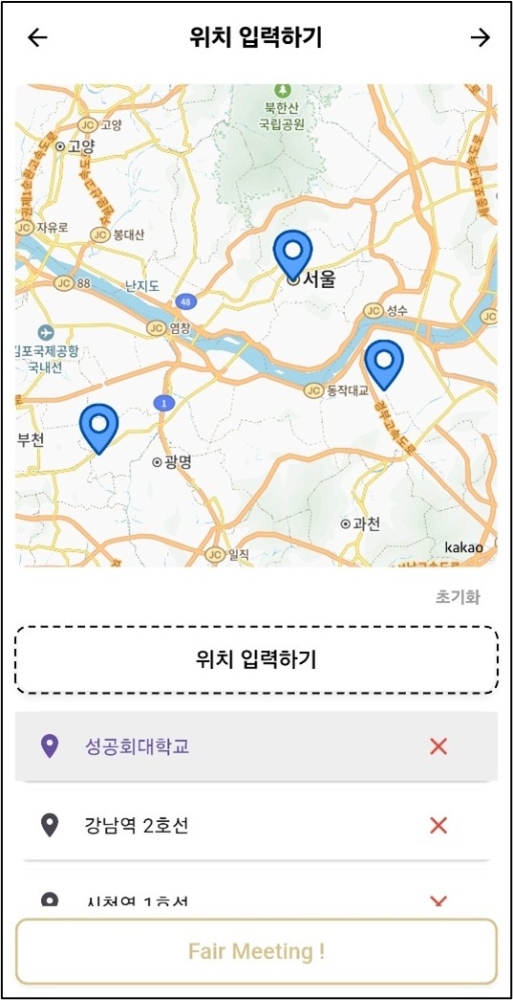
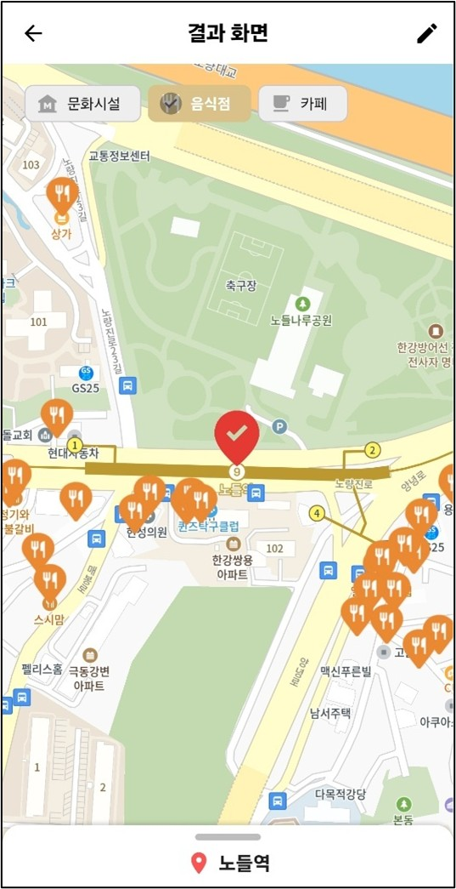
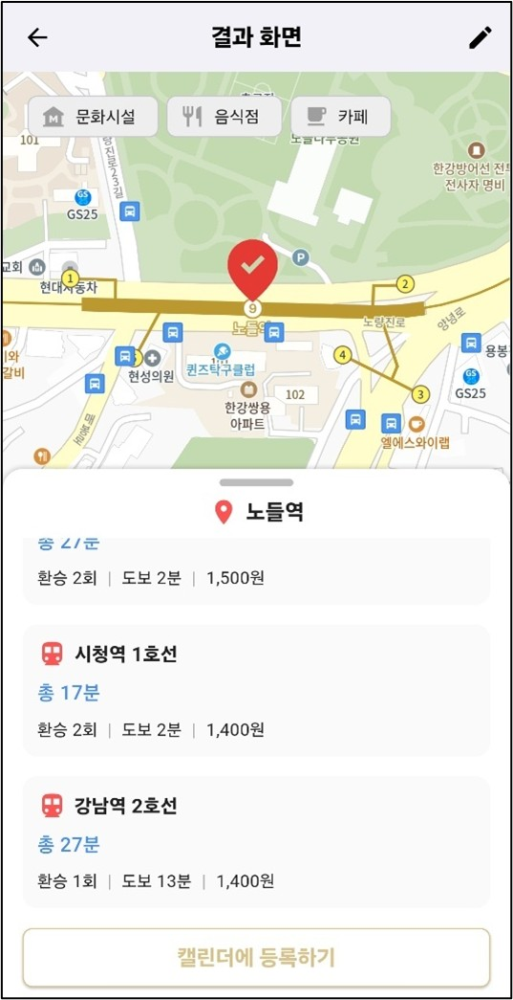
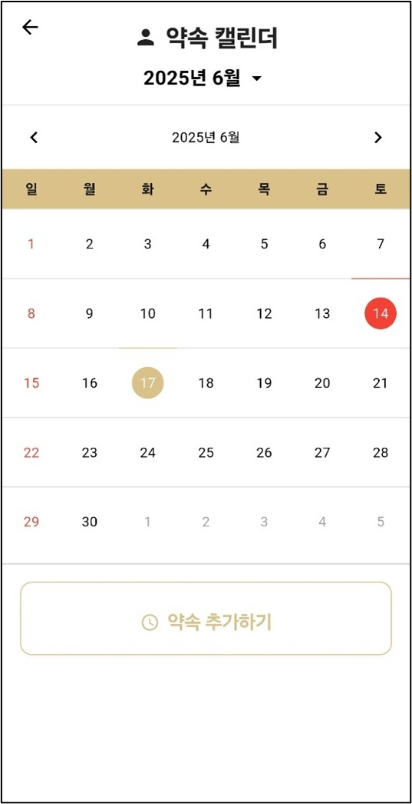

# FairMeeting

## 📌 프로젝트 개요
**FairMeeting**은 사용자의 출발 위치를 기반으로 최적의 중간지점을 계산하고,  
카테고리별 장소 추천, 일정 등록, 푸시 알림까지 제공하는 약속 관리 앱입니다.  

기존 서비스의 단점을 보완하며, **소요 시간 편차 최소화 알고리즘**을 활용하여  
더 공정한 만남 장소를 추천합니다. 

---

## 🖼 주요 화면 미리보기

  
  
  

  
  
  

---

## ✨ 주요 기능

- 📍 **공정한 중간지점 계산** (시간 편차 최소화)
- 🍽️ **카테고리별 장소 추천** (음식점, 카페, 문화시설 등)
- 🗓️ **캘린더 연동 및 일정 저장**
- 🔔 **약속 24시간 전 푸시 알림**
- 🧭 **네이버 길찾기 연동**
- 📤 **카카오톡 약속 공유**
- 🔐 **카카오 로그인 및 비회원 모드 지원**

---

### ✅ Frontend
- Flutter (Dart)
- Kakao Map SDK (지도 렌더링 및 장소 검색)
- Provider (전역 상태 관리)
- SharedPreferences (로컬 데이터 저장)
- table_calendar (캘린더 UI 구성)
- flutter_local_notifications (푸시 알림 예약 및 실행)
- url_launcher (외부 링크 이동: 네이버 길찾기 등)
- geolocator (GPS 기반 현재 위치 수신)
- kakao_flutter_sdk_user (카카오 로그인 연동)
- flutter_timezone, timezone (시간대 기반 알림 처리)

### ✅ Backend
- Spring Boot (Java 21)
- REST API, JWT 인증
- JPA, MyBatis

### ✅ Infra & DB
- AWS EC2 (배포 서버)
- AWS RDS (MySQL)
- Neo4j (지하철 경로 탐색용 그래프DB)
