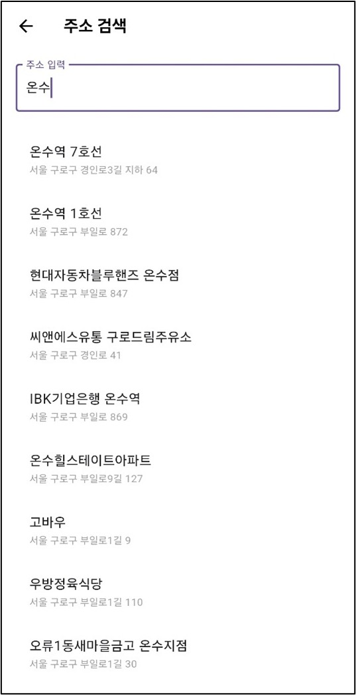
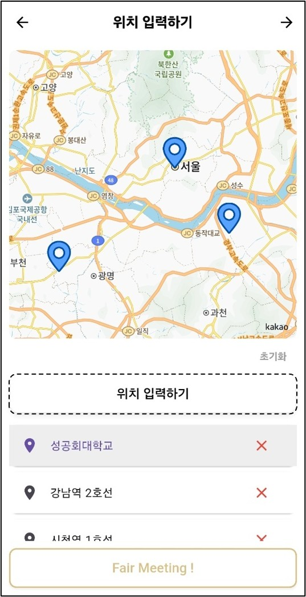
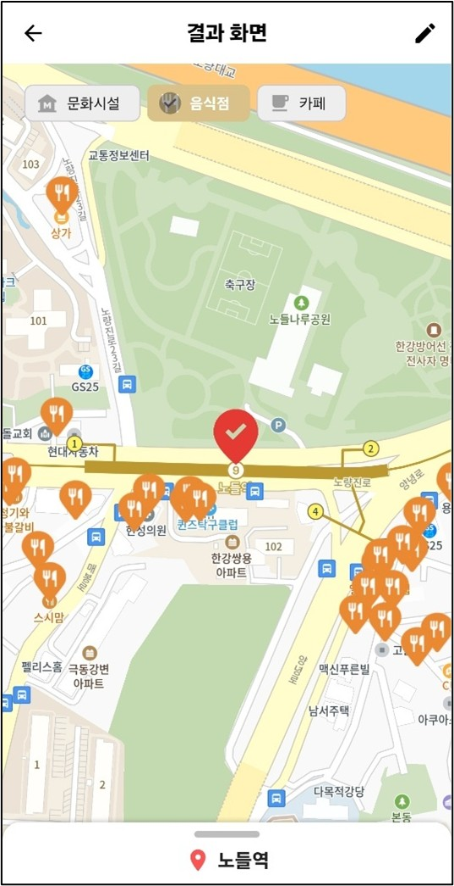
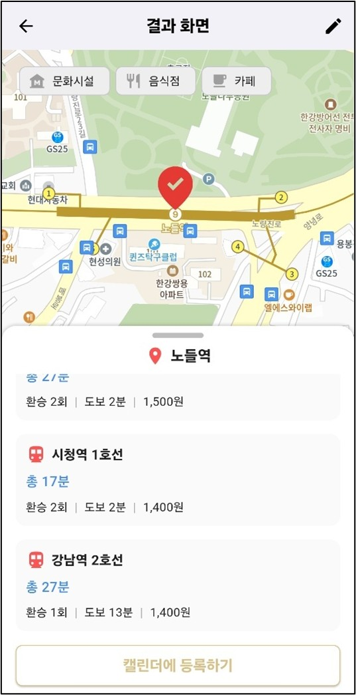
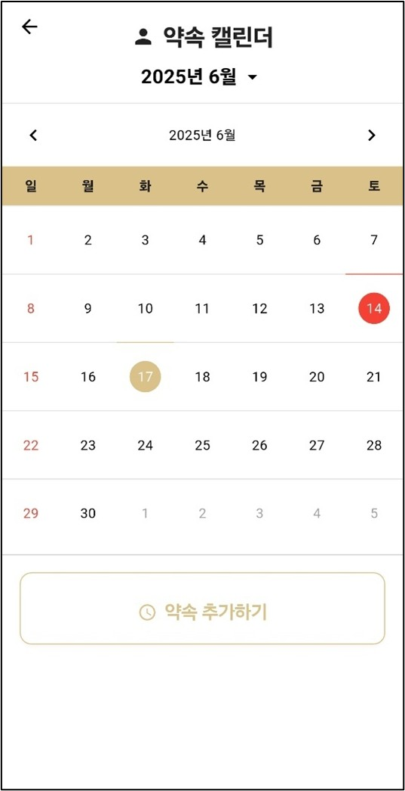
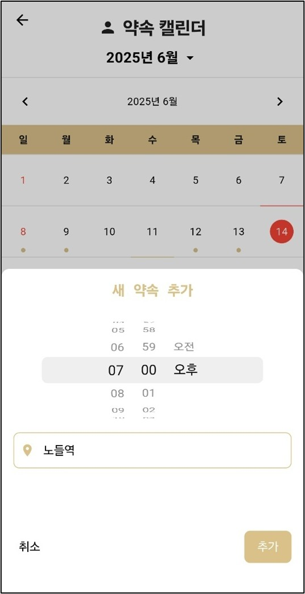
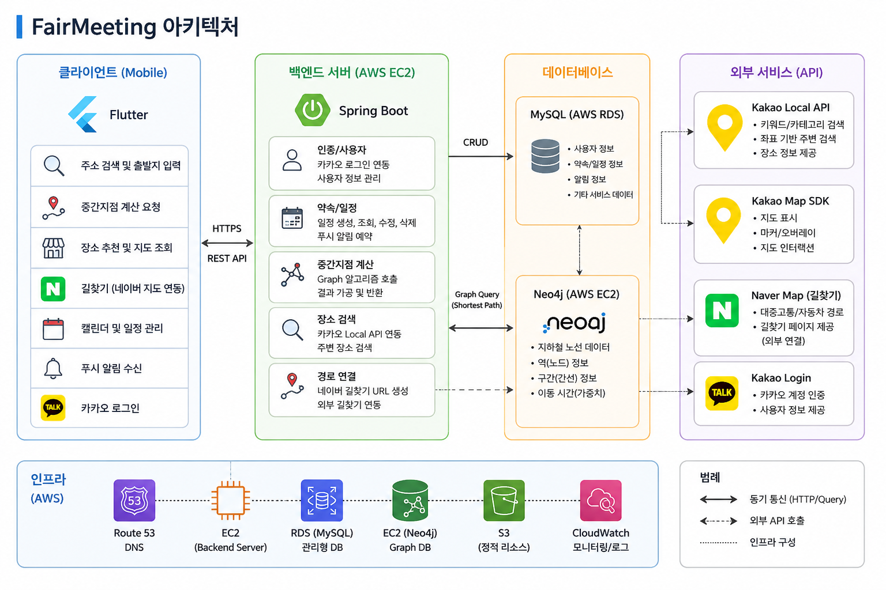

# FairMeeting

## 📌 프로젝트 개요

여러 사람이 약속 장소를 정할 때는 각 출발지의 단순한 지리적 중심을 기준으로 장소를 선택하는
경우가 많습니다. 그러나 지리적으로 가까운 거리라도 노선과 환승 횟수에 따라 실제 이동 시간은
크게 달라질 수 있어 특정 참여자에게 이동 부담이 집중될 수 있습니다.

**FairMeeting**은 각 출발지에서 후보 지점까지의 대중교통 이동 시간을 비교하고, 참여자 간 이동
시간 편차가 가장 작은 지점을 계산하여 보다 공정한 약속 장소를 추천하는 모바일 앱입니다.

- **프로젝트 기간**: 2025.03.10 ~ 2025.06.15 (컴퓨터공학 캡스톤디자인)
- **팀 구성**: 3인

> 본 저장소는 포트폴리오 정리를 위해 개인 계정으로 옮긴 사본입니다.
> 
> 원본 저장소: [Backend](https://github.com/fairmeeting/fair_back) · [Frontend](https://github.com/fairmeeting/fair_front)

---

## 👥 팀 구성 (컴퓨터공학 캡스톤디자인, 3인)

| 이름 | 역할 |
|---|---|
| 홍창희 | 비즈니스 로직 구현 (중간지점 계산 알고리즘, 검색/경로 API, 예외 처리) |
| 임채환 | DB & Server |
| 윤찬혁 | UI 구현 |

---

## 🎬 데모 영상

[](https://youtu.be/0NHQ85YaOBU)

---

## 🖼 주요 화면 미리보기

<p>
  
  
  
</p>

<p>
  
  
</p>

<p>
  
  
</p>

---

## ✨ 주요 기능

- 📍 **공정한 중간지점 계산** (시간 편차 최소화)
- 🍽️ **카테고리별 장소 추천** (음식점, 카페, 문화시설 등)
- 🗓️ **캘린더 연동 및 일정 저장**
- 🔔 **약속 24시간 전 로컬 알림**
- 🧭 **네이버 길찾기 연동**
- 📤 **카카오톡 약속 공유**
- 🔐 **카카오 로그인 및 비회원 모드 지원**

---

## 🛠 기술 스택

### ✅ Frontend

- Flutter (Dart)
- Kakao Map SDK (지도 렌더링 및 장소 검색)
- Provider (전역 상태 관리)
- SharedPreferences (로컬 데이터 저장)
- table_calendar (캘린더 UI 구성)
- flutter_local_notifications (약속 시간 기준 로컬 알림 예약 및 실행)
- url_launcher (외부 링크 이동: 네이버 길찾기 등)
- geolocator (GPS 기반 현재 위치 수신)
- kakao_flutter_sdk_user (카카오 로그인 연동)
- flutter_timezone, timezone (시간대 기반 알림 처리)

### ✅ Backend

- Java 21, Spring Boot
- REST API
- MyBatis (사용자·일정 CRUD)
- Neo4j Java Driver (Cypher 쿼리로 지하철역·노선 그래프 데이터 조회)
- 인증: Flutter에서 카카오 로그인을 수행하고, 전달받은 카카오 사용자 식별자(kakaoId)를
  기준으로 백엔드에서 사용자 정보를 조회·등록. 별도의 자체 JWT 인증 서버는 구현하지 않음

### ✅ Infra & DB

- AWS EC2 (배포 서버)
- AWS RDS (MySQL)
- Neo4j (지하철 경로 탐색용 그래프DB)

---

## 🏗 아키텍처



Flutter 클라이언트는 Spring Boot 서버와 REST API로 통신합니다. 사용자와 일정 데이터는
MySQL에 저장하고, 지하철역과 노선 정보는 그래프 구조에 적합한 Neo4j에 저장했습니다.

중간지점 계산 시 백엔드는 Neo4j에서 역과 노선 데이터를 조회한 뒤, Java로 직접 구현한
다중 출발지 다익스트라 알고리즘을 실행합니다. 각 출발지에서 후보 역까지의 이동 시간을
계산하고, 참여자 간 이동 시간 편차가 가장 작은 역을 최종 중간지점으로 선정합니다.

장소명·주소 검색과 중간지점 주변의 카테고리별 장소 검색에는 Kakao Local API를 사용하며,
지도 표시는 Kakao Map SDK로 처리합니다. 대중교통 경로와 소요시간은 ODsay API를 통해
조회하고, 최종 장소까지의 상세 길찾기는 네이버 지도 외부 링크로 연결합니다.

---

## 🧮 핵심 알고리즘 & 예외 처리

여러 출발지에서 후보 역까지의 이동 시간을 계산한 뒤, 이동 시간 편차가 가장 작은 역을
중간지점으로 선정합니다. 지하철 노선 데이터는 Neo4j에 노드와 간선으로 저장하고, 조회한
그래프 데이터를 기반으로 Java에서 **다중 출발지 다익스트라 알고리즘과 N-1 부분집합
최적화**를 직접 구현했습니다.

계산이 무의미해지거나 실패할 수 있는 경계 상황 6종을 정의하고 예외 처리를 구현했습니다.

| # | 경계 상황 | 처리 결과 |
|---|---|---|
| 1 | 출발지가 2개 미만 | 실행 차단 + 안내 메시지 |
| 2 | 출발지가 5개 초과 | 추가 입력 제한 + 안내 메시지 |
| 3 | 출발지 간 거리가 한 정거장 수준으로 근접 | 실행 차단 + 안내 메시지 |
| 4 | 출발지 중 하나가 계산된 중간지점과 동일 | 소요시간 0분으로 정상 처리 (예외 아님) |
| 5 | 서비스 범위(수도권 1~9호선) 밖의 역이 출발지인 경우 | 실행 차단 + 안내 메시지 |
| 6 | 동일 출발지를 여러 번 입력 | 중복 포함하여 정상 계산 |

---

## 🚀 실행 방법

### Backend 환경변수

`backend` 폴더에 `.env` 파일을 생성합니다.

```env
DB_URL=jdbc:mysql://localhost:3306/fairmeeting
DB_USERNAME=your_username
DB_PASSWORD=your_password

NEO4J_URI=bolt://localhost:7687
NEO4J_USERNAME=neo4j
NEO4J_PASSWORD=your_password

KAKAO_API_KEY=your_kakao_rest_api_key
ODSAY_KEY=your_odsay_api_key
```

### Backend 실행

```bash
cd backend
./mvnw spring-boot:run
```

서버는 기본적으로 `8088` 포트에서 실행됩니다.

### Backend 실행 (Docker)

```bash
cd backend
docker compose up -d --build
```

### Frontend 실행

```bash
cd frontend
flutter pub get
flutter run
```

---

🔗 [Figma 디자인 바로가기](https://www.figma.com/design/yHoLZvf0cIJbxY7TDWtGf3/%EC%BA%A1%EC%8A%A4%ED%86%A4?node-id=1-4&t=Bd3fprzq6y4rB3VY-0)
